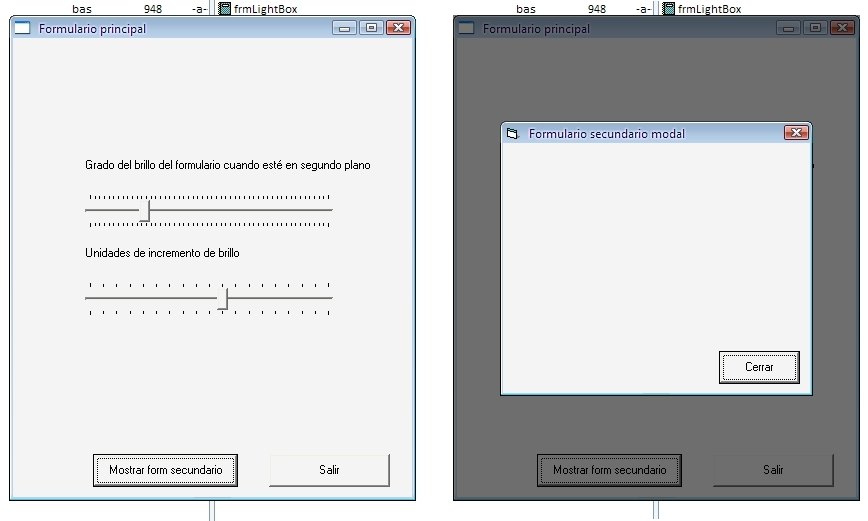



## LIGHTBOXv2\*\*\* \*/REFIXED/\* the UNIQUE on PSC\. VISTA EFFECT on modal forms, \*\*MUST SEE\*\*

### Description

LIGHTBOXv2*** */REFIXED/* the UNIQUE on PSC. VISTA EFFECT on modal forms, **MUST SEE**

i was in a hurry... fixed some important errors. Download this file instead.

brightness adjust to the disabled form

now the ability to change brightness (-255 to 255 :: -100% to 100%)

and the ability to change the increment of change (0 to 18)

special thanks to Florian Egel for his "FoxCBMP3.dll" post "Advanced Graphics Routines 3.2 UPDATED **must see!**" - made this code possible.

"foxcbmp3.dll" was renamed to "lightbox.dll" and embedded into a .res file and is extracted automatically when the application starts.

i used the function "FoxBrightness" to adjust the image.

sorry for my english, i'm from argentina

download and test!!!
 
### More Info
 

             |
---                |---
**Submitted On**   |2010-05-04 21:42:06
**By**             |[Santiago M\. Sidera](https://github.com/Planet-Source-Code/PSCIndex/blob/master/ByAuthor/santiago-m-sidera.md)
**Level**          |Advanced
**User Rating**    |5.0 (10 globes from 2 users)
**Compatibility**  |VB 3\.0, VB 4\.0 \(16\-bit\), VB 4\.0 \(32\-bit\), VB 5\.0, VB 6\.0, VB Script, ASP \(Active Server Pages\) , VBA MS Access, VBA MS Excel
**Category**       |[Graphics](https://github.com/Planet-Source-Code/PSCIndex/blob/master/ByCategory/graphics__1-46.md)
**World**          |[Visual Basic](https://github.com/Planet-Source-Code/PSCIndex/blob/master/ByWorld/visual-basic.md)
**Archive File**   |[LIGHTBOXv2218024552010\.zip](https://github.com/Planet-Source-Code/santiago-m-sidera-lightboxv2-refixed-the-unique-on-psc-vista-effect-on-modal-forms-must-se__1-73114/archive/master.zip)

